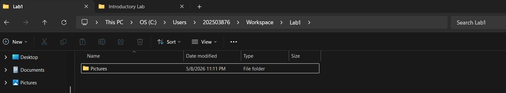
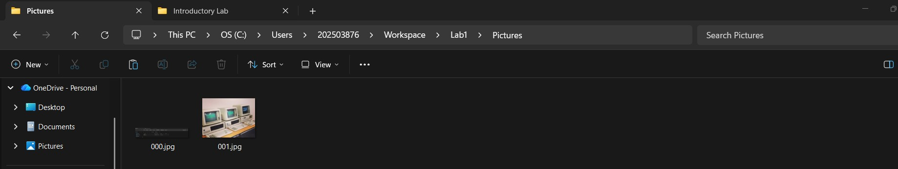
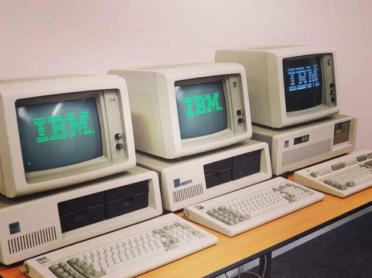
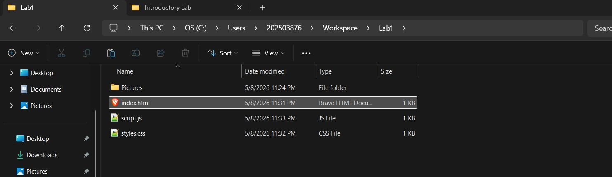
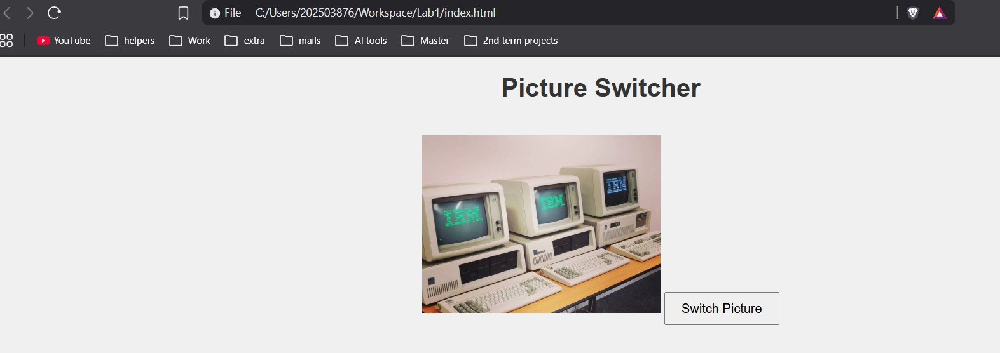
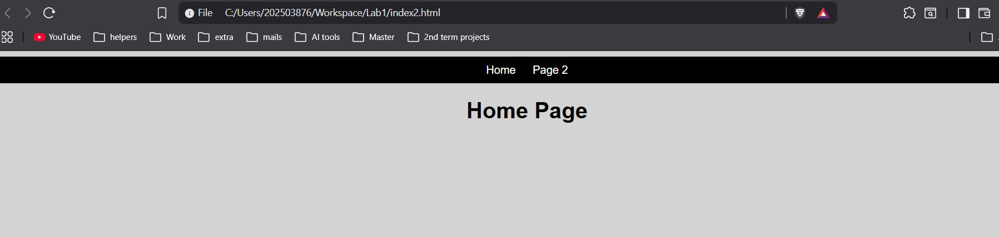
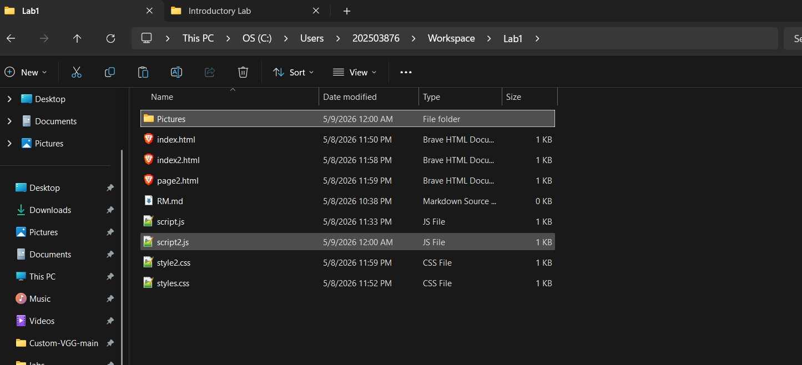

# Introductory Lab

- Learned how to use the CS Workspace safely
- Created folders and managed files
- Practiced taking and editing screenshots in Paint
- Built a simple website using HTML, CSS, and JavaScript
- Added image switching functionality
- Improved website styling and readability
- Added multiple pages and a navigation bar
- Uploaded the project to GitHub for backup and version control

## Using the Workspace

We accessed the local Workspace through the C drive user profile and used it as a secure location for storing project files. A new folder named `Lab1` was created inside the Workspace, followed by another folder named `Pictures` to store the images used later in the lab.

## Screenshot Editing and Saving Images

We used the Windows screenshot tool to capture an image from the internet and pasted it onto the picture of the three PCs using Paint. After adjusting the image, it was saved as a PNG file named `001` inside the `Pictures` folder in the Lab1 directory.

 

## Creating and Saving a Drawing

We created a new drawing in Paint based on the edited image from the previous task. The drawing was then saved as a PNG file named `002` inside the `Pictures` folder.

## creating first website

## Improving Website Readability

We modified the `styles.css` file by changing the background and heading colours to improve the readability and appearance of the website.

## Adding Multiple Pages and Navigation

We added multiple HTML pages to the website and linked them together using anchor tags. A simple navigation bar was also created to allow easy movement between the pages of the portfolio.

## Uploading the Project to GitHub

We uploaded the `Lab1` project folder to GitHub to back up the work and enable version control. This ensured the project could be accessed and managed online.

