# Lab 4 Placeholder

## Pre-Lab Tasks
I created a new folder in my local workspace and used git pull to download my GitHub repository into it. 
 
 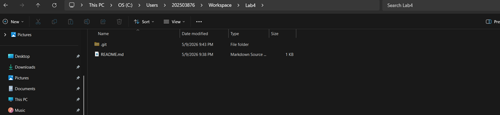
 
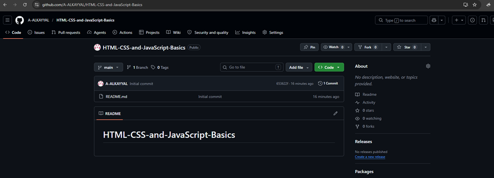

## Adding CSS and JavaScript Folders
I created a styles.css file and a script.js file in the same folder as my index.html. After saving both files, my local repository contained index.html, styles.css, and script.js. 

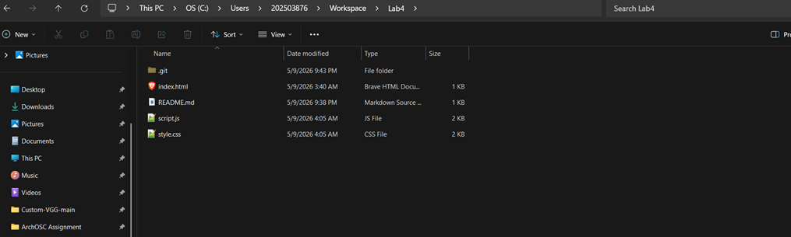
 
## Referencing CSS and JavaScript in HTML
I added <link rel="stylesheet" href="styles.css"> inside the <head> section and  at the bottom of the <body> section.
 
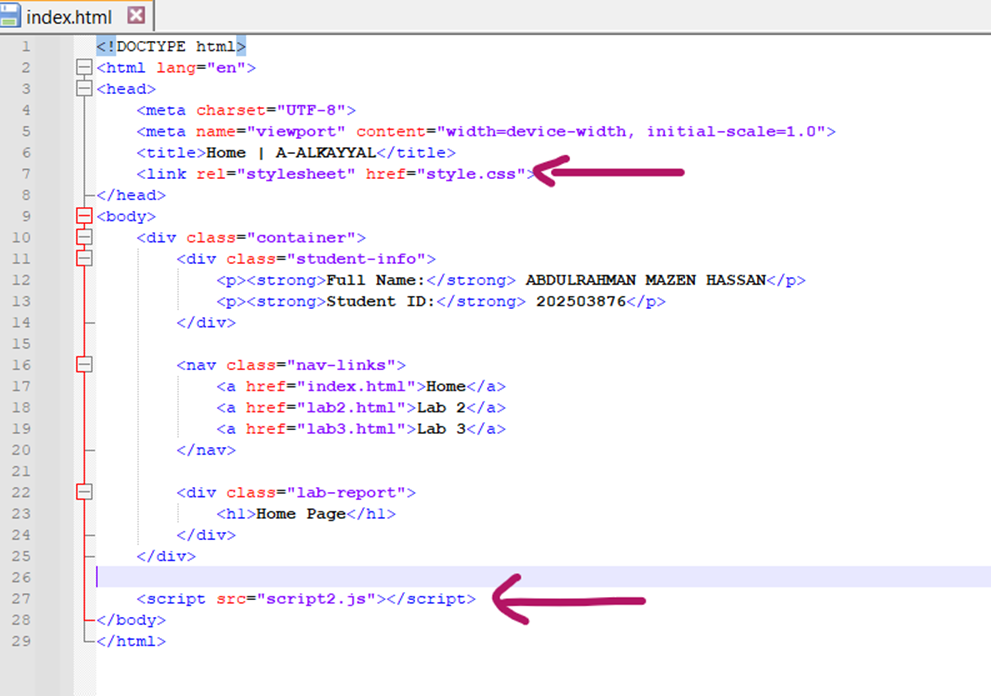

## Creating HTML Pages for Each Lab
I created two new HTML files named lab1.html (for last week's lab) and lab2.html (for this week's lab) using the same HTML template. These separate pages help organize content by lab session for easier navigation.
 
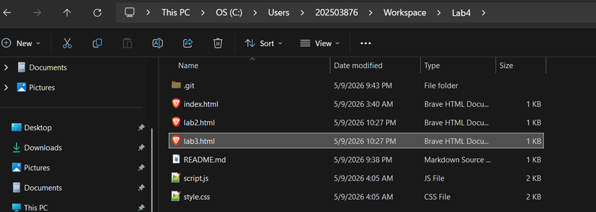

## Moving Lab Content to Separate Pages
I opened my index.html file, located the descriptions and screenshots from each lab, then copied the content from the first GitHub lab into lab1.html and the content from the second GitHub lab into lab2.html. After moving everything, my index.html now contains only the HTML skeleton and the CSS/JavaScript references, with all lab content removed from it.
 
 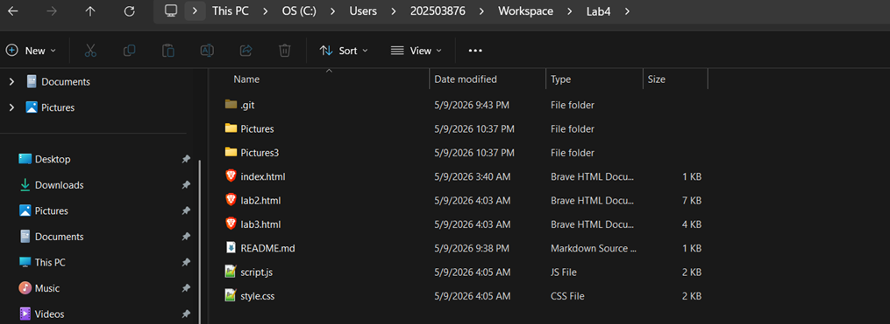

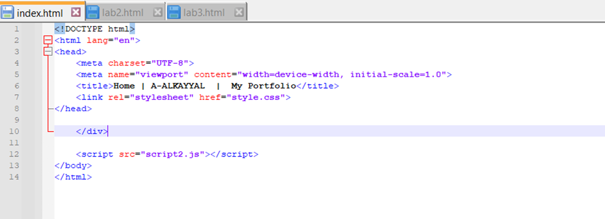

## Adding Portfolio Content and CSS Styling
I added <h1>Welcome to my Portfolio!</h1>, <h2>By [Your Name]</h2>, and a 
 paragraph to index.html. Then I updated styles.css to style the heading orange. The CSS targets the h1 element and changes its color, showing how CSS controls the visual appearance of HTML elements.
 
 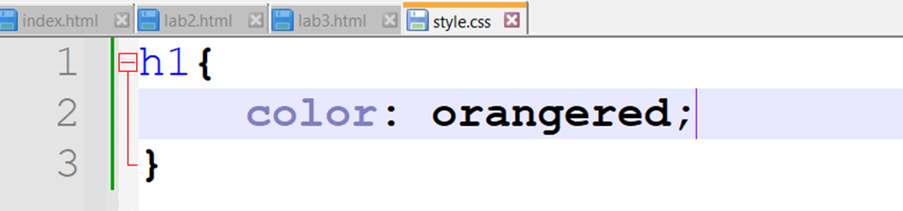

 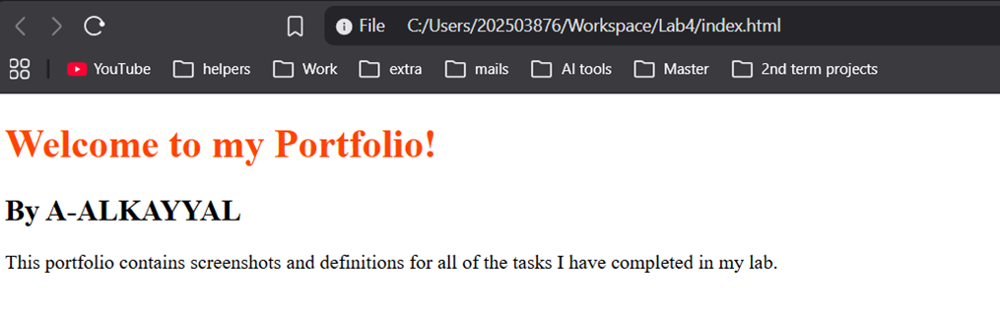
 
## Using CSS Classes for Targeted Styling
I added class="name" to the <h2> element and class="description" to the 
 element in index.html. Then in styles.css, I created class selectors (.name and .description) to style each element differently — orange, green, and pink. Using classes allows me to target specific elements without affecting all elements of the same tag, giving more control and flexibility in design.
 
 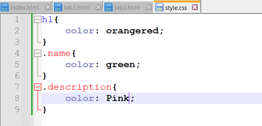

 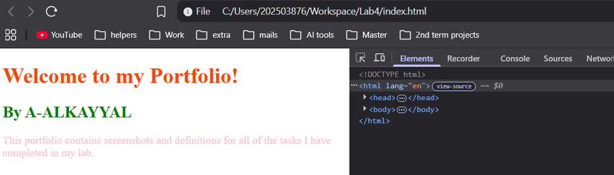
 
## Adding Navigation Links to Other Pages
I added an ordered list (<ol>) with <li> items containing <a> tags linking to index.html, lab1.html, and lab2.html. This creates clickable links on my portfolio page, allowing easy navigation between the index page and my individual lab pages.
 
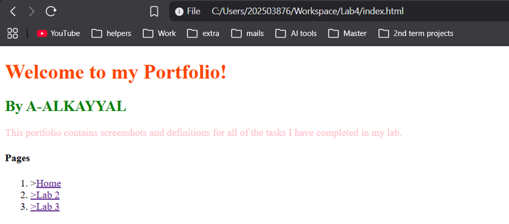

## Turning Links into a Nav Bar
I converted the ordered list of links into a navigation bar (navbar) using HTML. This improves the website's layout and makes it easier to move between the index page and each lab page.
I simply added (<nav class="nav-links">
            <a href="index.html">Home</a>
            <a href="lab2.html">Lab 2</a>
			<a href="lab3.html">Lab 3</a>
        </nav>)
To all the html files.
 
 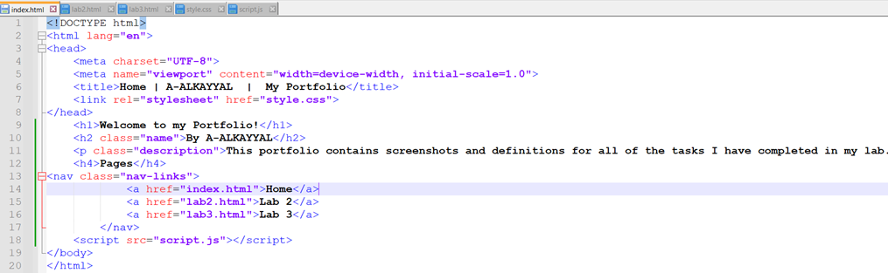

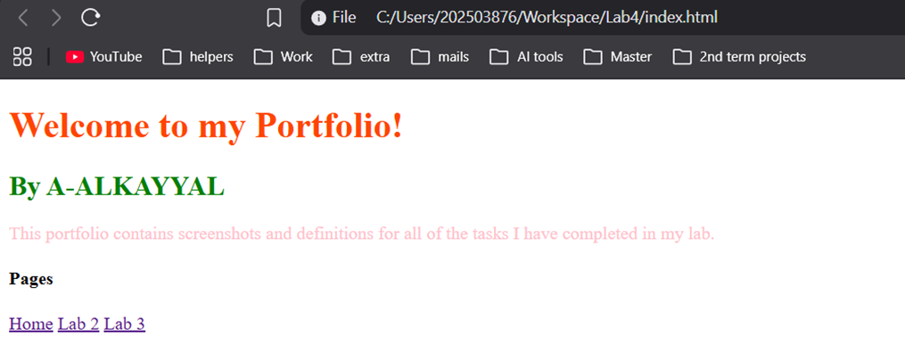

## Creating a Dark Mode Button
I added a button with id="darkModeToggle" to my website, created dark mode CSS classes (e.g., .dark-mode for background and text colors), and wrote JavaScript to listen for button clicks using toggleBtn.addEventListener("click", () => { document.body.classList.toggle("dark-mode"); });. This toggles dark mode on and off when pressed.
 
 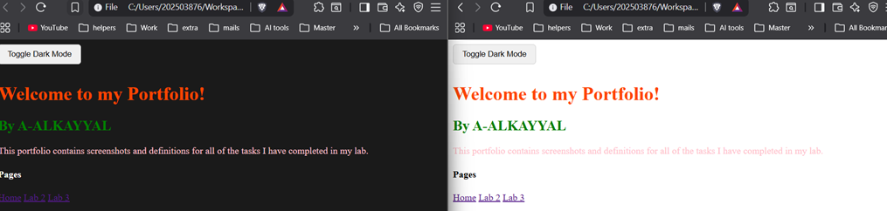

## Finished the lab:
https://github.com/A-ALKAYYAL/HTML-CSS-and-JavaScript-Basics 
 
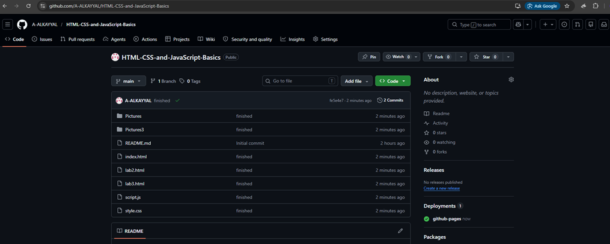