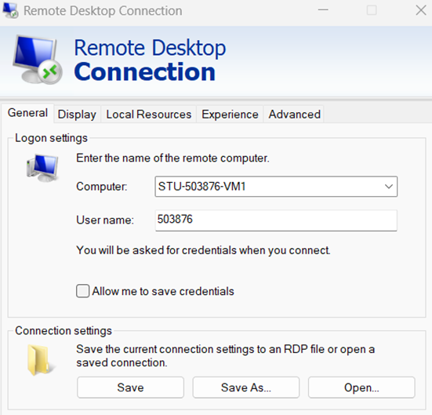
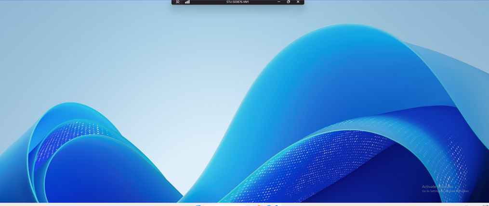
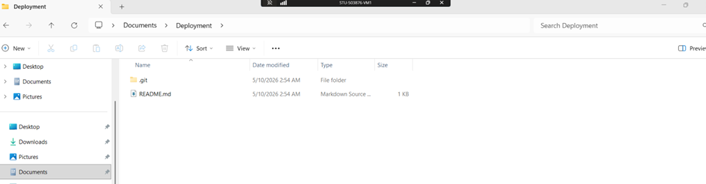
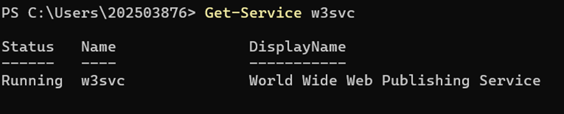
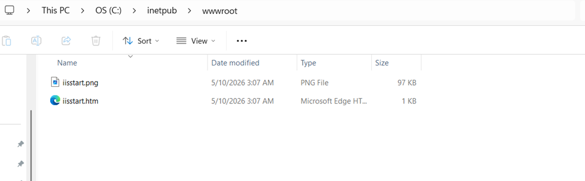
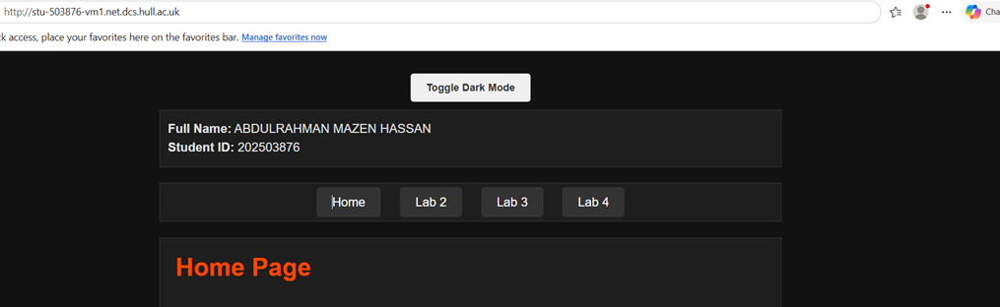
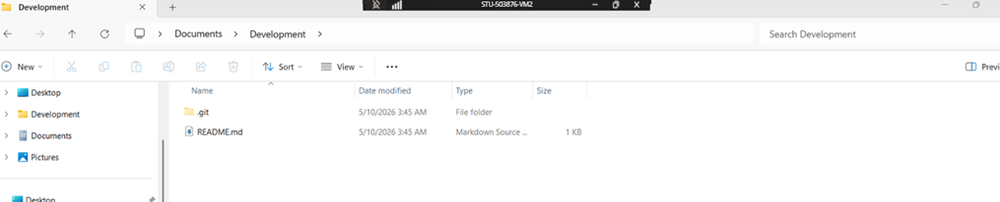
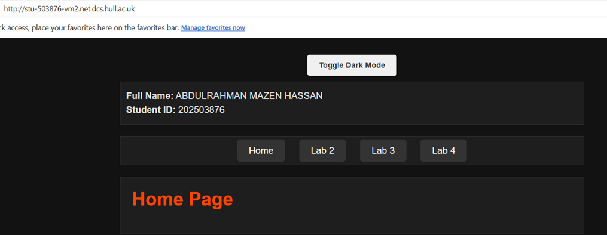
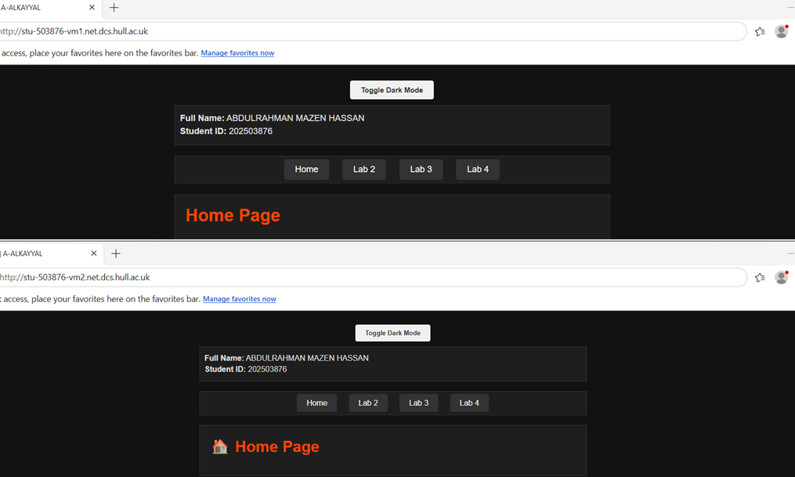

# Lab 5 Placeholder
 

## Accessing and Setting Up a VM
I used Remote Desktop Connection to connect to my VM (STU-503876-VM1) with my student number as the username and university password. After logging in, I checked for Git using git version, installed Git when needed (setting default branch to "main" and keeping default options), then navigated to the Documents folder, created a Deployment folder, and cloned my portfolio repository into it.
 

## Accessing and Setting Up a VM
I successfully opened the VM using Remote Desktop Connection, then cloned my portfolio repository into the Deployment folder.
 

## Setting Up A VM For Web Hosting
I checked that IIS was running by entering Get-Service w3svc in the terminal and confirmed the World Wide Web Publishing Service was active. Then I navigated to This PC → Local Disk (C:) → inetpub → wwwroot on the VM.
 
 

 
 
## Deploying Website on IIS
I copied all files from my Deployment folder into C:\inetpub\wwwroot on the VM. Then I opened a browser on my local machine and entered http://stu-503876-vm1.net.dcs.hull.ac.uk, which displayed my website live from the VM.
 

## Setting Up a Development VM (VM2)
I opened a second VM named STU-503876-VM2. I created a Development folder, cloned my portfolio repository into it, then copied all files into C:\inetpub\wwwroot. I accessed the website at http://stu-503876-vm2.net.dcs.hull.ac.uk, which displayed my portfolio live from the development VM.
 

 
## Editing a Development VM
I installed Visual Studio Code on STU-503876-VM2, opened my website from the wwwroot folder, and made a small change. When saving failed due to permissions, I clicked "Retry as admin" and the change saved successfully. My original website remained at http://stu-503876-vm1.net.dcs.hull.ac.uk and the updated version at http://stu-503876-vm2.net.dcs.hull.ac.uk. Having both a development and deployment server allows testing changes safely on the development VM before pushing them live to the deployment server, preventing broken code from reaching users.

### Simple Change Made: Added an emoji to the Home Page heading for better visual appeal.
And the screenshot shows the two opened together.
 

