# Lab 6 Placeholder

## Using ipconfig on VM1
I logged into STU-503876-VM1, opened a terminal, and entered the ipconfig command. This displayed the IP address and network configuration details for the virtual machine, confirming it is connected to the virtual network.
 
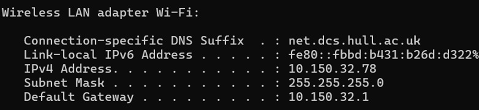

## Using ipconfig on VM2
I logged into STU-503876-VM2, opened a terminal, and entered the ipconfig command. This showed the IP address and network settings for my development VM, confirming it is on the same virtual network as VM1. 

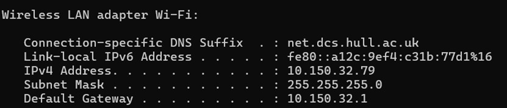

## Pinging VM2 from VM1
I went back to STU-503876-VM1, opened the terminal, and ran ping [VM2sIP]. The response confirmed that both virtual machines can communicate with each other over the virtual network without any issues.

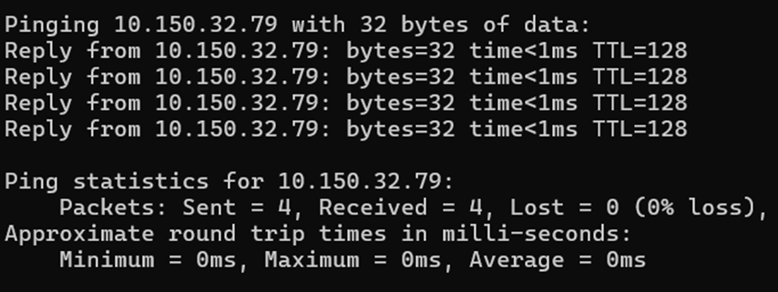
 
## Pinging VM1 from VM2
I logged into STU-503876-VM2, opened the terminal, and ran ping [VM1sIP]. The successful response confirmed that the development VM can also communicate with the deployment VM over the virtual network.

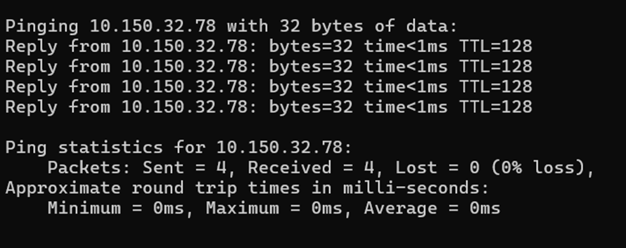
 
## Using VM instead of GitHub Pages
I went to my portfolio repository on GitHub, clicked Settings, then scrolled down to Actions and opened the Runners section to set up a local runner that will allow automatic updates from my development VM to my deployment VM.

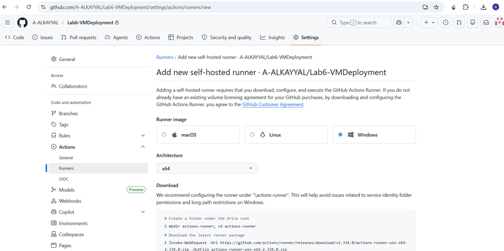
 
## Setting Up a Self-Hosted Runner on VM2
I went to GitHub repository Settings → Actions → Runners, clicked "New self-hosted runner", selected Windows OS, then opened a terminal on STU-503876-VM2 and copied the commands from GitHub one by one. I kept the default name as the VM name, set the work folder to _work, skipped adding labels, and chose not to run as a service. Finally, I entered ./run.cmd and the runner started listening for jobs.

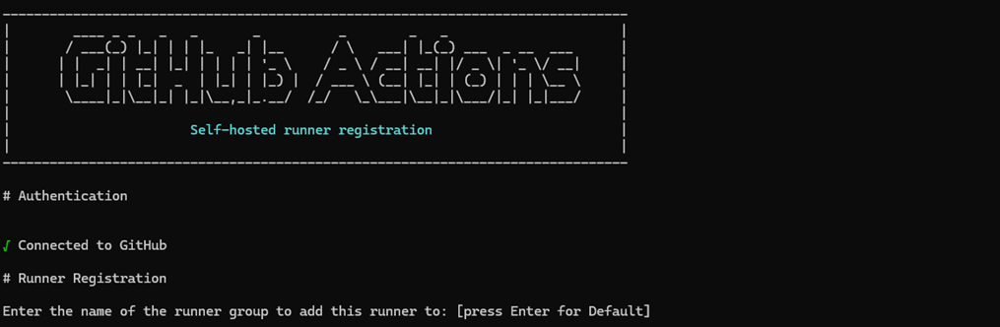
 
## Deploying to the Runner
I closed the runner on STU-503876-VM2, created a WebsiteBackup folder on the desktop, cut my portfolio from C:\inetpub\wwwroot and pasted it into the backup folder. I then navigated to \actions-runner, right-clicked run.cmd and selected "Run as administrator" to start the runner in admin mode. Finally, I went back to my GitHub repository, clicked the Actions tab, and selected "New Workflow" to write new YAML for deploying to the runner.

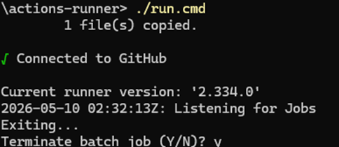
 
## Creating PushToVM YAML
I selected "Set up a workflow yourself", renamed the file to PushToVM.yml, and entered the YAML code to automatically push my GitHub repository to the VM and copy the files to the IIS default location (C:\inetpub\wwwroot). I then committed the changes. The runner on STU-503876-VM2 must be running for this to work.

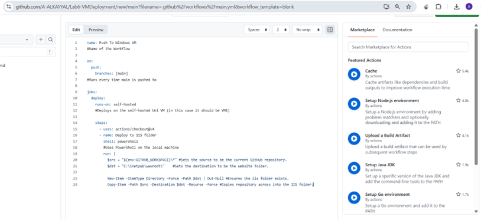

 
## Pushing to GitHub and Checking VM1
I pushed my completed repository to GitHub, then opened a browser and went to http://stu-503876-vm1.net.dcs.hull.ac.uk/. The updated version of my website was now live on the deployment VM. I pushed again to confirm the workflow runs automatically.

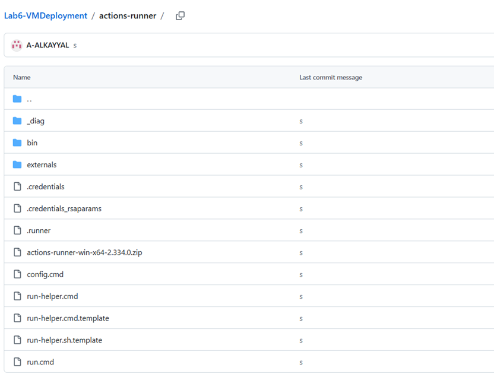

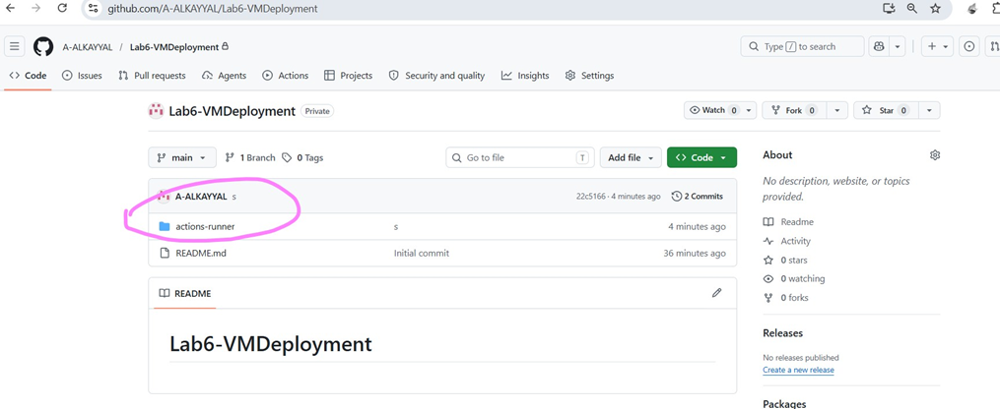
 
### The updated version of my website with Lab 6 added was now live on the deployment VM. 
 
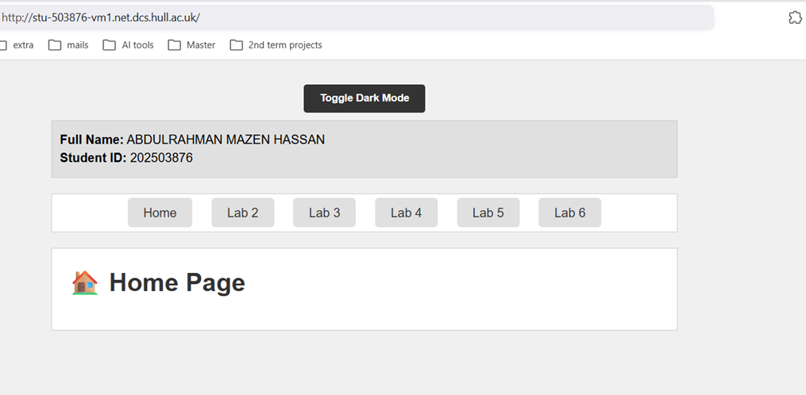