# Lab 7 Placeholder

This lab covers CPU scheduling concepts including long-term, medium-term, and short-term schedulers. I will implement First-Come-First-Serve (FCFS) and Round-Robin scheduling algorithms in C#, then visualize the results using Gantt charts. The lab requires Visual Studio Code with C# and Project (available only on campus CS/CSE machines). All code must be properly commented, inputs validated, and meaningful variable names used. For each code we represent a flowchart and the related Gantt charts.

## Long-Term Scheduling
This lab covers CPU scheduling concepts including long-term, medium-term, and short-term schedulers. I implemented First-Come-First-Serve (FCFS) scheduling using the task data from Table 1 (Tasks A–G with their Entry Time, Duration, and Priority/Rank). The code filters tasks where Rank > 5, sorts them by arrival time, then simulates FCFS execution tracking start and finish times. Gantt chart visualisation is included as required. All inputs are validated and variable names are meaningful.

 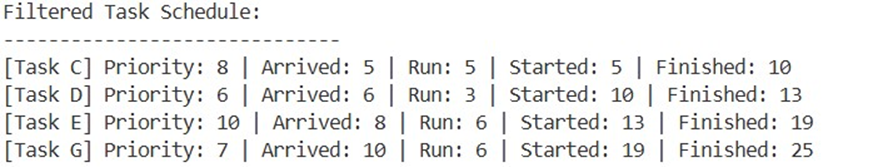

 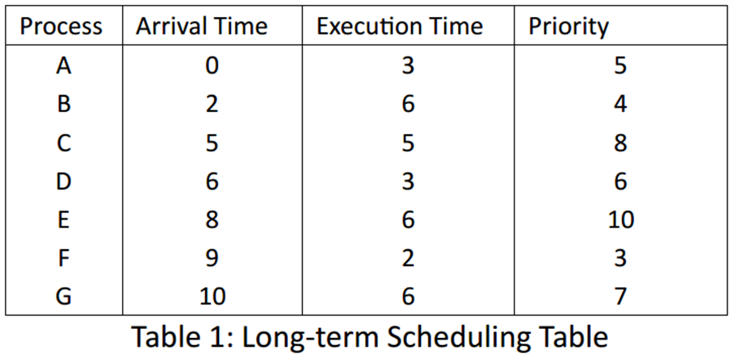

 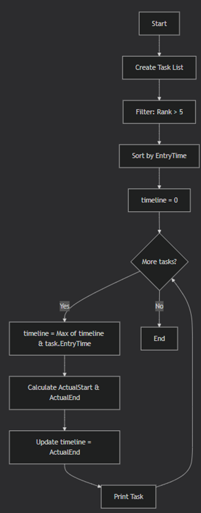

 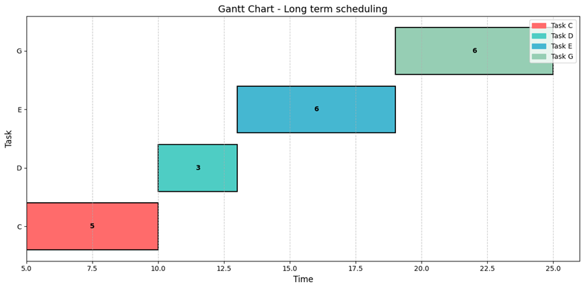
 
 
## Short-Term Scheduling (CPU) Task 1: FCFS Scheduling
I implemented FCFS scheduling using Table 2 in C#. The program sorts processes by arrival time, then calculates for each process: Finish Time (Start + Execution), Turnaround Time (Finish - Arrival), and Normalized Turnaround Time (Turnaround / Execution). The Gantt chart visually represents the order of execution showing when each process runs on the CPU

 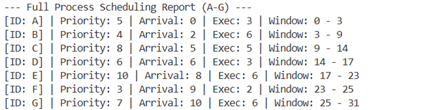

 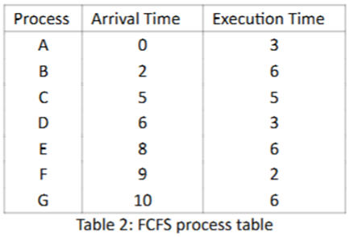
 
 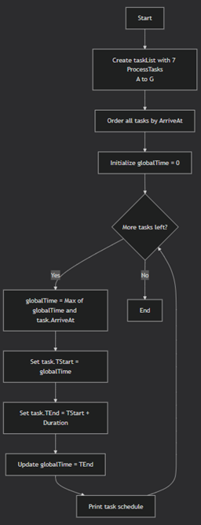

 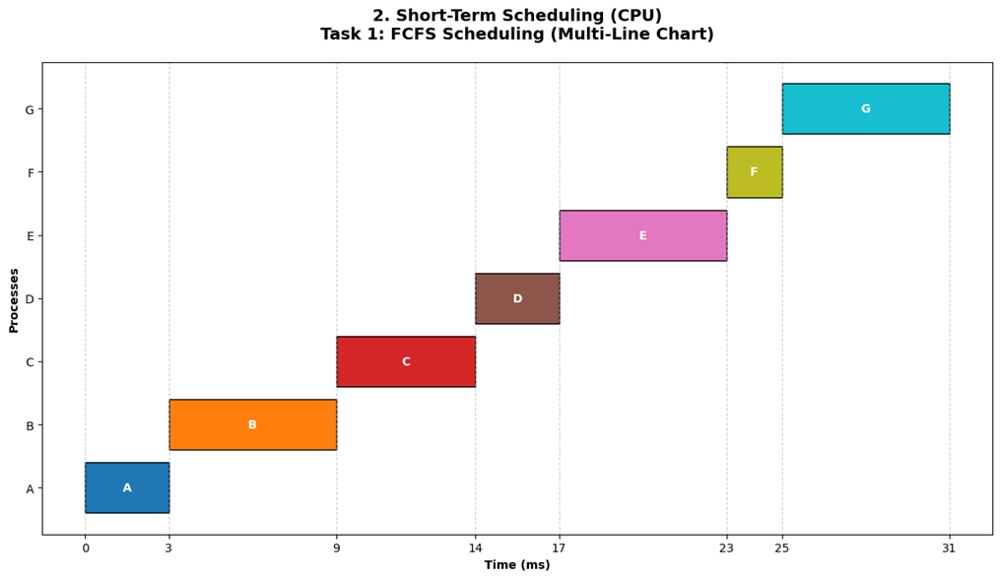
 
 
## Round-Robin Scheduling
I implemented Round-Robin scheduling with time slices TQ = 1, 3, 4, and 6, calculated finish, turnaround, and normalized turnaround times for each process, and plotted Gantt charts. Smaller time slices increased context switching and turnaround time; larger slices behaved like FCFS.
 	 
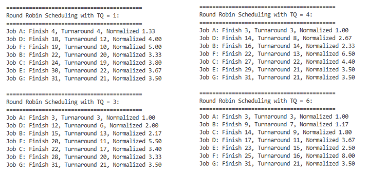

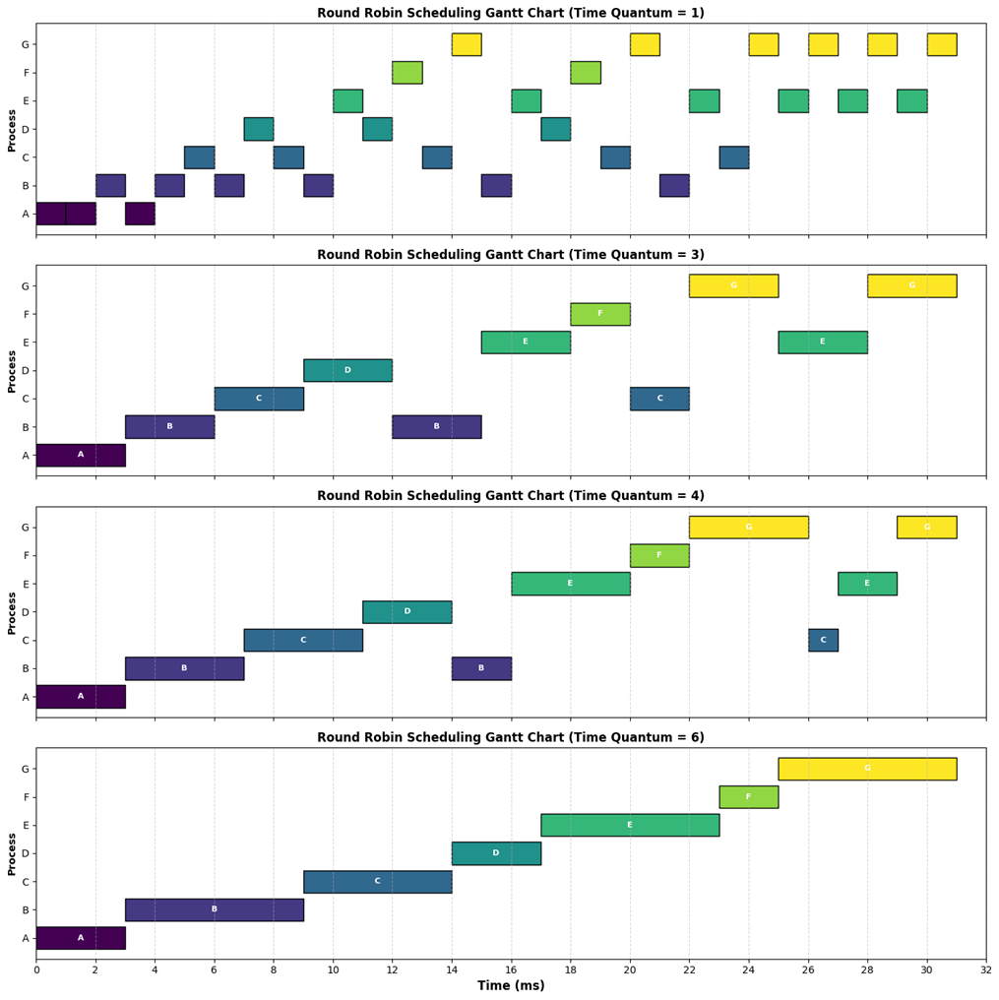

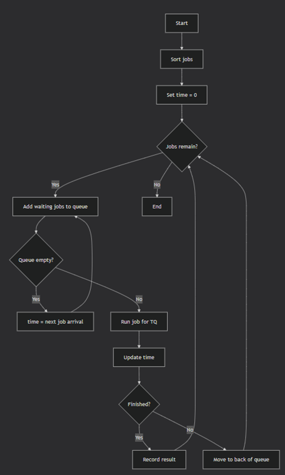

## Context Switching
I extended the Round-Robin simulation to include priority-based scheduling using data from Table 2, with time quantums TQ = 1 and 6. Priority determined execution order, while the time quantum controlled how long each process ran before context switching. The Gantt charts show that smaller time slices (TQ = 1) caused frequent context switches, increasing overhead, while larger slices (TQ = 6) reduced switching but allowed lower-priority processes to block higher-priority ones longer. Priority scheduling improved response time for high-priority tasks but increased waiting time for low-priority ones.
 
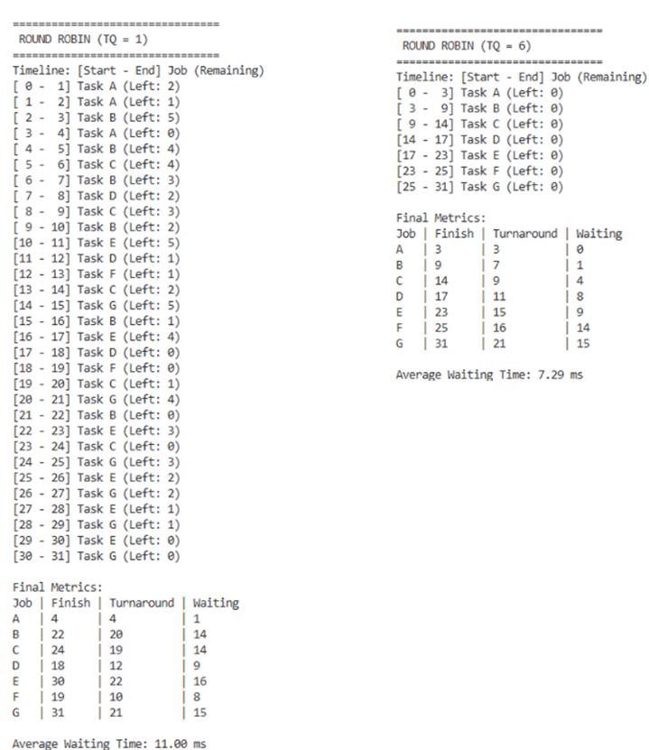
 
 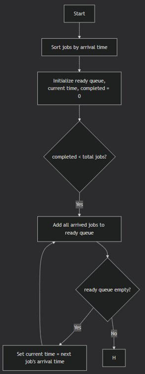

 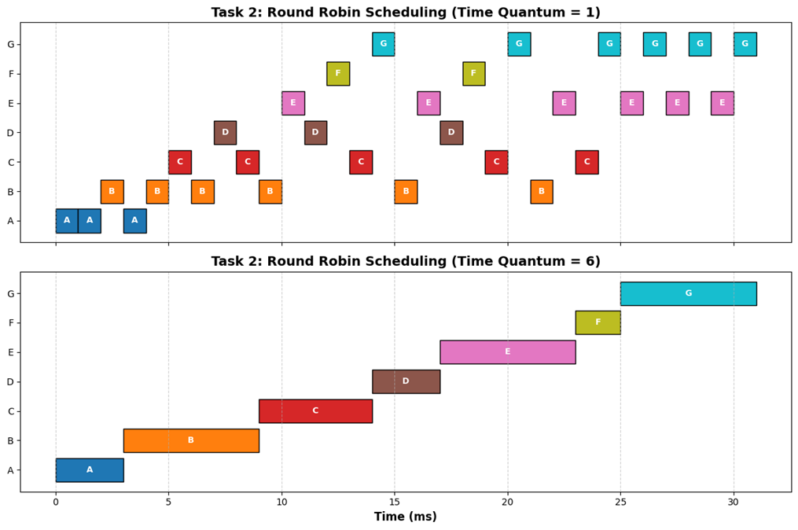