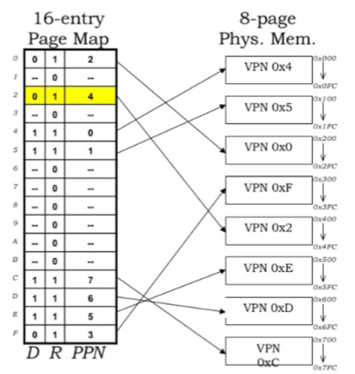
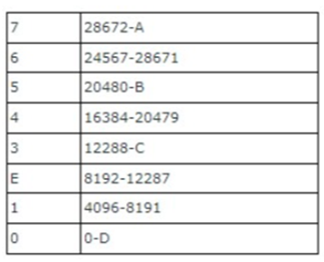
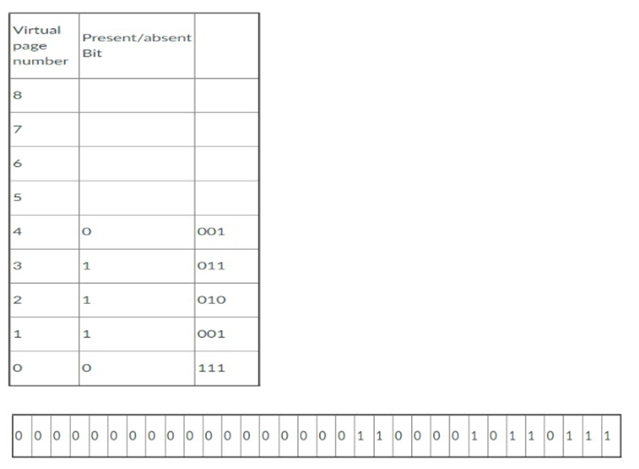
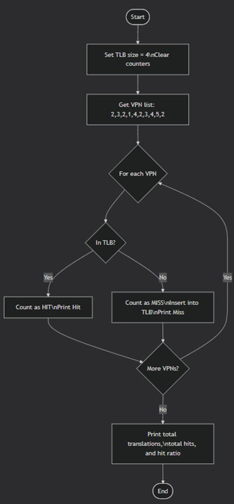
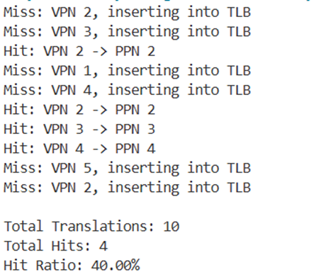

# Lab 8 Placeholder
I completed memory management tasks including virtual memory, paging, page tables, and TLB simulation using C#. I calculated virtual/physical page numbers and offsets, determined page frame values, and simulated TLB hits/misses with hit ratio tracking. I also worked on memory interfacing using decoders and combined address patterns to read/write specific memory locations.

## Task 1:
(i) Virtual Pages and Bytes per Page
	Virtual pages: With a 4-bit virtual page number (VPN), the number of virtual pages is 2^4=16.
	Bytes per page: With an 8-bit offset, the page size is 2^8=256 bytes.
(ii) Address Translation Example
Next figure illustrates 16 virtual pages mapped to 8 physical pages. A load instruction references the virtual address 0x2C8. We need to determine the VPN, offset, and the corresponding physical page number (PPN).
 

Step 1 – Convert to binary
0x2C8=0010" " 1100" " 1000_2
	0x2 → 0010
	0xC → 1100
	0x8 → 1000
Step 2 – Extract VPN and offset
	VPN: The top 4 bits 0010 → VPN = 0x2
	Offset: The bottom 8 bits 1100\,1000 → Offset = 0xC8
Step 3 – Find PPN
Using the page map in Figure 40, VPN 0x2 maps to PPN 0x4.

## Task 2
 

Each page frame is 4096 bytes (4 KB).
The end address is calculated as:
"End address"="Start address"+4095
	D: Frame 0 starts at 0
→ End = 0+4095=4095
	C: Frame 3 starts at 12288
→ End = 12288+4095=16383
	B: Frame 5 starts at 20480
→ End = 20480+4095=24575
	A: Frame 7 starts at 28672
→ End = 28672+4095=32767

## Task 3
a What is the virtual page being referenced?
From Figure 41, the first 20 bits of the virtual address are:
00000000000000000001
In decimal: 1
The referenced virtual page is 1.
________________________________________
b Page frame value (in both binary and denary)
For Virtual Page Number 1, the page table indicates:
Present/Absent bit = 1 (page is present)
Page frame bits = 001
Thus, the page frame value is:
Binary: 001
Decimal: 1
________________________________________
c Construct the physical address
The physical address is formed by concatenating:
The page frame bits from 2.b (001)
The offset bits (the last 12 bits of the virtual address)
Resulting physical address:
001100001011011
 

## Task 4
(i) Pages in physical memory:
"Physical Memory Size" /"Page Size" =(2^24 " Bytes" )/(2^10 " Bytes/page" )=2^14 " pages"=16,384" pages" 
(ii) Entries in the page table:
"Virtual Memory Size" /"Page Size" =(2^32 " Bytes" )/(2^10 " Bytes/page" )=2^22 " entries"=4,194,304" entries" 
(iii) Bits per entry in page table:
"PPN bits"+"Control bits"=14" bits"+2" bits"=16" bits (or 2 bytes)" 
(iv) Pages occupied by page table:
"Total Page Table Size"=2^22×16" bits/entry"=2^23 " bytes"
(2^23 " Bytes" )/(2^10 " Bytes/page" )=2^13 " pages"=8,192" pages" 
 

 
## Task 5
5.1 Address Decoding
The memory contains 14 locations (indices 0 to D in hexadecimal).
To address all locations:
"Address bits"=⌈〖log⁡〗_2 (14)⌉=4" bits" 
since 2^4=16≥14.
Decoder Configuration
	Maps 4-bit address inputs to 16 chip select lines (CS0 – CS15)
	Only 14 outputs (CS0 – CS13) are used
Data Path
Each memory location stores 4 hexadecimal digits:
"Data width"=4" digits"×4" bits/digit"=16" bits" 
Control Signals
	WR – Active-low write enable
	RD – Active-low read enable
	EN – Global memory enable
________________________________________
5.2
	Pattern format (active HIGH): WR RD EN A3 A2 A1 A0
	Target: Read content FEAD
	Location: FEAD is at Index A
	Index A (hex) → Binary 1010 for A3 A2 A1 A0
Setting bits for "Read Index A":
	WR = 0
	RD = 1
	EN = 1
	A3 A2 A1 A0 = 1 0 1 0
Combined address (WR RD EN A3 A2 A1 A0):
0111010
Hexadecimal result: 0x3A
