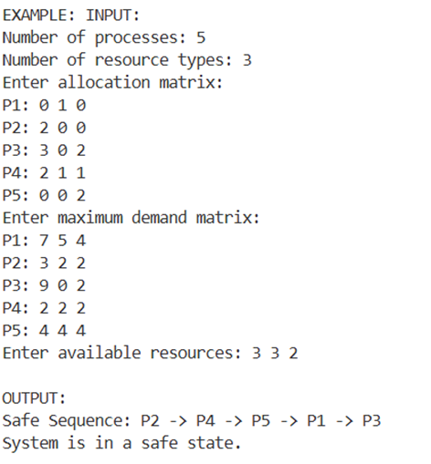
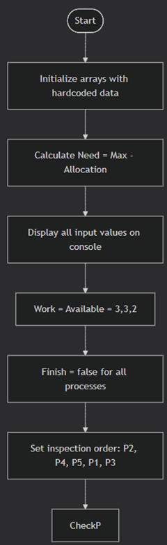

# Lab 9 Placeholder

I applied the Banker's Algorithm to determine safe or unsafe states for five processes (P1-P5) with three resource types (R1, R2, R3). I manually analyzed the initial state (R1=10, R2=5, R3=7), then repeated the analysis after increasing R1 to 12, and again after increasing R2 to 7. I reflected on how additional resources affect process execution order and system performance. Finally, I implemented a C# program that accepts user input for allocation, maximum need, and available resources, then outputs whether the system is in a safe state along with the safe execution sequence.

## Manual Analysis with Banker's Algorithm

A system contains five processes labeled P1 through P5 and three resource categories labeled R1, R2, and R3. The following table presents the maximum resource demand for each process.

| Process | R1 | R2 | R3 |
|---------|----|----|----|
| P1      | 7  | 5  | 4  |
| P2      | 3  | 2  | 2  |
| P3      | 9  | 0  | 2  |
| P4      | 2  | 2  | 2  |
| P5      | 4  | 4  | 4  |

Because the original allocation matrix and available resources were not specified, the values in the following table are used as assumptions.

| Process | R1 | R2 | R3 |
|---------|----|----|----|
| P1      | 0  | 1  | 0  |
| P2      | 2  | 0  | 0  |
| P3      | 3  | 0  | 2  |
| P4      | 2  | 1  | 1  |
| P5      | 0  | 0  | 2  |

**Remaining Available Resources:** R1 = 3, R2 = 3, R3 = 2

The following table shows the remaining resource needs for each process, calculated by subtracting allocated resources from maximum demands.

| Process | R1 | R2 | R3 |
|---------|----|----|----|
| P1      | 7  | 4  | 4  |
| P2      | 1  | 2  | 2  |
| P3      | 6  | 0  | 0  |
| P4      | 0  | 1  | 1  |
| P5      | 4  | 4  | 2  |

### Step 1: Compute the Need Matrix

The remaining resource requirements for each process are found by subtracting the resources already allocated from the maximum resources requested. The formula used is:
Need = Maximum Demand – Allocation

The resulting need values are displayed in the following table.

| Process | R1 | R2 | R3 |
|---------|----|----|----|
| P1      | 7  | 4  | 4  |
| P2      | 1  | 2  | 2  |
| P3      | 6  | 0  | 0  |
| P4      | 0  | 1  | 1  |
| P5      | 4  | 4  | 2  |

### Step 2: Determine a Safe Execution Order

The system begins with the available resources: Work = (3, 3, 2).

**Iteration 1 – Process P2**
- P2 requires (1, 2, 2). Since (1, 2, 2) ≤ (3, 3, 2), P2 can proceed.
- After P2 finishes, its allocated resources (2, 0, 0) are released.
- Work updates to: (3, 3, 2) + (2, 0, 0) = (5, 3, 2)
- P2 is marked as complete.
- Safe sequence so far: **P2**

**Iteration 2 – Process P3**
- P3 requires (6, 0, 0). Since (6, 0, 0) ≤ (5, 3, 2), P3 can proceed.
- After P3 finishes, its allocated resources (3, 0, 2) are released.
- Work updates to: (5, 3, 2) + (3, 0, 2) = (8, 3, 4)
- P3 is marked as complete.
- Safe sequence so far: **P2 → P3**

**Iteration 3 – Process P4**
- P4 requires (0, 1, 1). Since (0, 1, 1) ≤ (8, 3, 4), P4 can proceed.
- After P4 finishes, its allocated resources (2, 1, 1) are released.
- Work updates to: (8, 3, 4) + (2, 1, 1) = (10, 4, 5)
- P4 is marked as complete.
- Safe sequence so far: **P2 → P3 → P4**

**Iteration 4 – Process P5**
- P5 requires (4, 4, 2). Since (4, 4, 2) ≤ (10, 4, 5), P5 can proceed.
- After P5 finishes, its allocated resources (0, 0, 2) are released.
- Work updates to: (10, 4, 5) + (0, 0, 2) = (10, 4, 7)
- P5 is marked as complete.
- Safe sequence so far: **P2 → P3 → P4 → P5**

**Iteration 5 – Process P1**
- P1 requires (7, 4, 4). Since (7, 4, 4) ≤ (10, 4, 7), P1 can proceed.
- After P1 finishes, its allocated resources (0, 1, 0) are released.
- Work updates to: (10, 4, 7) + (0, 1, 0) = (10, 5, 7)
- P1 is marked as complete.
- Safe sequence so far: **P2 → P3 → P4 → P5 → P1**

### Final Outcome

- The system is in a **safe state**, meaning all processes can finish execution without encountering a deadlock.
- One valid safe execution order is: **P2 → P3 → P4 → P5 → P1**

---

## Increasing Resources

The available resources have been increased to the following values:  
**R1 = 12, R2 = 5, R3 = 7**

### Step 1: Compute the Need Matrix

The remaining resource requirements for each process are shown in the following table.

| Process | R1 | R2 | R3 |
|---------|----|----|----|
| P1      | 7  | 4  | 4  |
| P2      | 1  | 2  | 2  |
| P3      | 6  | 0  | 0  |
| P4      | 0  | 1  | 1  |
| P5      | 4  | 4  | 2  |

### Step 2: Determine a Safe Execution Order

The system starts with the available resources: Work = (12, 5, 7).

**Iteration 1 – Process P4**
- P4 requires (0, 1, 1). Since (0, 1, 1) ≤ (12, 5, 7), P4 can proceed.
- After P4 finishes, its allocated resources (2, 1, 1) are released.
- Work updates to: (12, 5, 7) + (2, 1, 1) = (14, 6, 8)
- P4 is marked as complete.
- Safe sequence so far: **P4**

**Iteration 2 – Process P2**
- P2 requires (1, 2, 2). Since (1, 2, 2) ≤ (14, 6, 8), P2 can proceed.
- After P2 finishes, its allocated resources (2, 0, 0) are released.
- Work updates to: (14, 6, 8) + (2, 0, 0) = (16, 6, 8)
- P2 is marked as complete.
- Safe sequence so far: **P4 → P2**

**Iteration 3 – Process P3**
- P3 requires (6, 0, 0). Since (6, 0, 0) ≤ (16, 6, 8), P3 can proceed.
- After P3 finishes, its allocated resources (3, 0, 2) are released.
- Work updates to: (16, 6, 8) + (3, 0, 2) = (19, 6, 10)
- P3 is marked as complete.
- Safe sequence so far: **P4 → P2 → P3**

**Iteration 4 – Process P5**
- P5 requires (4, 4, 2). Since (4, 4, 2) ≤ (19, 6, 10), P5 can proceed.
- After P5 finishes, its allocated resources (0, 0, 2) are released.
- Work updates to: (19, 6, 10) + (0, 0, 2) = (19, 6, 12)
- P5 is marked as complete.
- Safe sequence so far: **P4 → P2 → P3 → P5**

**Iteration 5 – Process P1**
- P1 requires (7, 4, 4). Since (7, 4, 4) ≤ (19, 6, 12), P1 can proceed.
- After P1 finishes, its allocated resources (0, 1, 0) are released.
- Work updates to: (19, 6, 12) + (0, 1, 0) = (19, 7, 12)
- P1 is marked as complete.
- Safe sequence so far: **P4 → P2 → P3 → P5 → P1**

### Final Outcome

- All processes can finish execution successfully, meaning the system remains in a safe state.
- One valid safe execution order is: **P4 → P2 → P3 → P5 → P1**

---

## Further Increase in Resources

The available resources have been updated to:  
**R1 = 12, R2 = 7, R3 = 7**

### Step 1: Compute the Need Matrix

The remaining resource requirements for each process are presented in the following table.

| Process | R1 | R2 | R3 |
|---------|----|----|----|
| P1      | 7  | 4  | 4  |
| P2      | 1  | 2  | 2  |
| P3      | 6  | 0  | 0  |
| P4      | 0  | 1  | 1  |
| P5      | 4  | 4  | 2  |

### Step 2: Determine a Safe Execution Order

The system begins with Work = (12, 7, 7).

**Iteration 1 – Process P4**
- P4 requires (0, 1, 1). Since (0, 1, 1) ≤ (12, 7, 7), P4 can execute.
- After completion, P4 releases its allocated resources (2, 1, 1).
- Work becomes: (12, 7, 7) + (2, 1, 1) = (14, 8, 8)
- P4 is marked as finished.
- Safe sequence so far: **P4**

**Iteration 2 – Process P2**
- P2 requires (1, 2, 2). Since (1, 2, 2) ≤ (14, 8, 8), P2 can execute.
- After completion, P2 releases its allocated resources (2, 0, 0).
- Work becomes: (14, 8, 8) + (2, 0, 0) = (16, 8, 8)
- P2 is marked as finished.
- Safe sequence so far: **P4 → P2**

**Iteration 3 – Process P3**
- P3 requires (6, 0, 0). Since (6, 0, 0) ≤ (16, 8, 8), P3 can execute.
- After completion, P3 releases its allocated resources (3, 0, 2).
- Work becomes: (16, 8, 8) + (3, 0, 2) = (19, 8, 10)
- P3 is marked as finished.
- Safe sequence so far: **P4 → P2 → P3**

**Iteration 4 – Process P1**
- P1 requires (7, 4, 4). Since (7, 4, 4) ≤ (19, 8, 10), P1 can execute.
- After completion, P1 releases its allocated resources (0, 1, 0).
- Work becomes: (19, 8, 10) + (0, 1, 0) = (19, 9, 10)
- P1 is marked as finished.
- Safe sequence so far: **P4 → P2 → P3 → P1**

**Iteration 5 – Process P5**
- P5 requires (4, 4, 2). Since (4, 4, 2) ≤ (19, 9, 10), P5 can execute.
- After completion, P5 releases its allocated resources (0, 0, 2).
- Work becomes: (19, 9, 10) + (0, 0, 2) = (19, 9, 12)
- P5 is marked as finished.
- Safe sequence so far: **P4 → P2 → P3 → P1 → P5**

### Conclusion

- The system continues to operate in a safe state, meaning no deadlock will occur.
- A valid safe execution order is: **P4 → P2 → P3 → P1 → P5**

---

## Implementing Banker's Algorithm

I implemented a C# program that calculates the need matrix, checks if processes can run safely, and outputs the safe sequence or declares an unsafe state.

